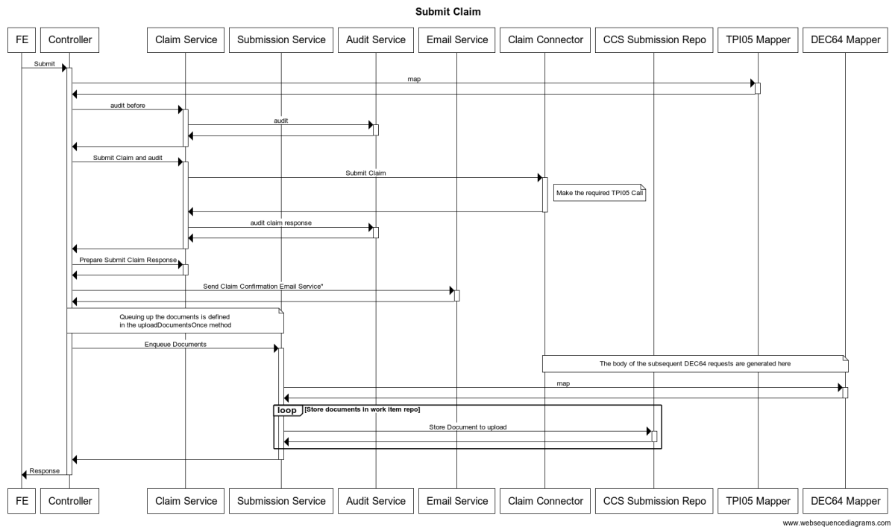

# cds-reimbursement-claim

This service provides a bridge between the `CDS Reimbursement Frontend` and external services.

### Submit a TPI05 Claim

#### Notes

Each of the different type of TPI05 claims that are made have different TPI05 & DEC64 Mappers that convert the frontend request into the appropriate format

### Submit a DEC64 Document

To make DEC64 calls we are using the `work-item-repo` library which provides an asynchronous method for performing tasks. 

When this service is started an instance of the `CcsSubmissionPoller` is spooled up. It is configured to periodically check the `CcsSubmissionRepo` to see if there are any requests that need to be made.

The tasks that need to be executed are queued up when making the TPI05 claim, the body of the DEC64 request that is made will be generated by the DEC64 mapper that is found in the `Submit Claim` section above.

### License

This code is open source software licensed under the [Apache 2.0 License]("http://www.apache.org/licenses/LICENSE-2.0.html").
